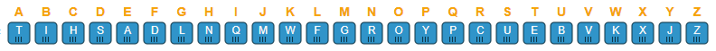

# Desafio Hackers Mirins

## Cifra
----

O próximo desafio também utiliza [cifras](https://pt.wikipedia.org/wiki/Cifra_de_substitui%C3%A7%C3%A3o_monoalfab%C3%A9tica),
mas desta vez a letras estão embaralhadas e teremos mais trabalho para desvendá-la.
Quando descobrir a resposta, aperte o botão "Já sei a resposta" e digite o número encontrado.

    Iseanorthaod t isenthae t iseano

Esta tabela vai ajudá-lo a desvendar este desafio.

<button onclick='
  var resposta = prompt("Qual é o número?");
  if (resposta == 444) {
    alert("Parabéns! Vamos para o próximo desafio!");
    window.location.href="Cifra";
  } else {
    alert("Resposta errada. Tente novamente.");
  }
'>Já sei a resposta!</button>
